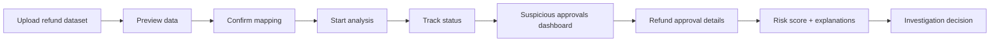

<p align="center">  </p>

<p align="center">
  A B2B platform for e-commerce companies that detects suspicious refund approvals by analyzing order history, return requests, and customer support decisions.
</p>

---

<h2 align="center">Project Overview</h2>

This project is a fraud and risk analytics system focused on a concrete e-commerce problem: **suspicious refund approvals in customer support workflows**.

The system helps e-commerce companies analyze historical data about:

* customer orders;
* return requests;
* refund amounts;
* support agent decisions;
* approval and decline patterns;
* customer return history;
* support agent approval patterns;
* suspicious customer-agent interactions;
* unusual refund behavior.

Examples of suspicious cases include:

* high-value refund approved without evidence;
* refund approved too quickly;
* manual override on expensive order;
* customer requests refunds too frequently;
* support agent has unusually high approval rate;
* same agent repeatedly approves refunds for the same customer;
* refund amount is close to full order amount.

The main goal is not only to show raw return data, but to calculate a **refund approval risk score** and explain why a specific refund approval may be suspicious.

The platform is designed for analysts, fraud teams, support managers, and e-commerce operations teams who need to investigate potentially risky refund decisions.

---

<h2 align="center">Track</h2>

**Startup track**

We are building a working MVP for a clear customer segment: **e-commerce companies with significant refund volume and customer support teams**.

Potential customer segments include:

* online marketplaces;
* e-commerce stores;
* retail platforms;
* delivery platforms with order refunds;
* retail platforms with customer support teams;
* companies with high refund volume;
* companies that need refund abuse and support decision monitoring.

This project fits the Startup track because it targets a specific business problem: e-commerce companies can lose money when refund approvals are made too frequently, too quickly, without enough evidence, or by support agents with suspicious approval patterns.

---

<h2 align="center">Problem</h2>

E-commerce companies regularly process refund requests. In many cases, support agents manually decide whether to approve or decline a refund.

This creates several risks:

* customers may abuse the refund process;
* expensive orders may be refunded without enough evidence;
* some customers may request refunds too frequently;
* some support agents may approve too many refund requests;
* the same agent may repeatedly approve refunds for the same customer;
* manual overrides may bypass normal refund rules;
* suspicious approval patterns may be hidden in large datasets.

Manual analysis is slow and does not scale well. Simple checks such as “customer has many refunds” are often not enough because they do not show the full context of the decision.

Our system solves this problem by combining:

* dataset upload;
* data normalization;
* structured storage of orders, returns, and support decisions;
* relationship graph construction;
* rule-based refund approval risk scoring;
* explainable risk reasons;
* analyst dashboard for investigation.

---

<h2 align="center">Architecture Overview</h2>

```mermaid
flowchart LR
    FE[Frontend Dashboard] -->|REST / HTTP| NGINX[Nginx Reverse Proxy]

    NGINX -->|REST| UPLOAD[Upload / Ingestion Service<br/>Go, Amir]
    NGINX -->|REST| SCORE[Scoring API Service<br/>Kotlin, Ernest]
    NGINX -->|REST| REL[Relations API Service<br/>Go, Nikita]
    NGINX -->|REST| STATUS[Analysis Status API<br/>Upload Service]

    UPLOAD --> PG[(PostgreSQL)]
    STATUS --> PG

    UPLOAD -->|publish: dataset.uploaded| MQ[(RabbitMQ pipeline.exchange)]

    MQ -. planned/partial .-> ML[ML / Normalization<br/>not a current Compose service]
    ML -. publish: dataset.normalized .-> MQ

    MQ -->|consume: dataset.normalized| REL
    REL -->|publish: refund.relations.built| MQ

    MQ -->|consume: refund.relations.built| SCORE
    SCORE -->|publish: refund.scoring.completed| MQ
```

Implemented in the current Compose MVP:

<table align="center">
  <tr>
    <th align="center">Layer</th>
    <th align="center">Responsibility</th>
  </tr>
  <tr>
    <td align="center"><b>Frontend</b></td>
    <td align="center">Analyst dashboard for uploading datasets, viewing analysis status, suspicious refund approvals, risk scores, explanations, and detailed return approval context</td>
  </tr>
  <tr>
    <td align="center"><b>Upload / Ingestion</b></td>
    <td align="center">Go service for uploading e-commerce refund datasets, creating analysis jobs, showing file preview, and publishing processing events to RabbitMQ</td>
  </tr>
  <tr>
    <td align="center"><b>Graph / Relations</b></td>
    <td align="center">Go service that computes graph-style relation features through service logic and API contracts; dedicated Graph DB storage is not connected yet</td>
  </tr>
  <tr>
    <td align="center"><b>Scoring</b></td>
    <td align="center">Kotlin service for calculating refund approval risk score, risk level, and explainable reasons for suspicious approvals</td>
  </tr>
  <tr>
    <td align="center"><b>Storage</b></td>
    <td align="center">PostgreSQL for dataset/job storage in implemented backend services; persisted normalized records, relation features, scores, and explanations are follow-up integration points</td>
  </tr>
  <tr>
    <td align="center"><b>Messaging</b></td>
    <td align="center">RabbitMQ pipeline exchange: <code>pipeline.exchange</code></td>
  </tr>
  <tr>
    <td align="center"><b>Deployment</b></td>
    <td align="center">Local Docker Compose is implemented; VM/public deployment link is pending verification</td>
  </tr>
</table>

Planned / partially integrated:

* ML / Normalization Service as a separate pipeline component.
* For the current demo, normalization is represented by prepared clean/dirty datasets, mapping documentation, and validation artifacts.
* Dedicated Graph DB storage remains optional/future work for the MVP.

---

<h2 align="center">User Flow</h2>

The main user flow starts with uploading an e-commerce refund dataset and ends with an analyst reviewing suspicious refund approvals with risk explanations.



<h2 align="center">Project Resources</h2>

<p align="center">
  This section contains the main technologies used in the project and links to project documentation.
</p>

<table align="center">
  <tr>
    <th align="center">Category</th>
    <th align="center">Item</th>
    <th align="center">Details</th>
  </tr>

  <tr>
    <td align="center" rowspan="9"><b>Tech Stack</b></td>
    <td align="center"><b>Frontend</b></td>
    <td align="center">React / TypeScript</td>
  </tr>
  <tr>
    <td align="center"><b>Upload Service</b></td>
    <td align="center">Go</td>
  </tr>
  <tr>
    <td align="center"><b>Scoring Service</b></td>
    <td align="center">Kotlin / Spring Boot</td>
  </tr>
  <tr>
    <td align="center"><b>Graph / Relations Service</b></td>
    <td align="center">Go</td>
  </tr>
  <tr>
    <td align="center"><b>ML / Normalization</b></td>
    <td align="center">Planned separate component; current demo uses prepared datasets and mapping docs</td>
  </tr>
  <tr>
    <td align="center"><b>Database</b></td>
    <td align="center">PostgreSQL</td>
  </tr>
  <tr>
    <td align="center"><b>Graph Storage</b></td>
    <td align="center">Not connected in current MVP; optional future storage</td>
  </tr>
  <tr>
    <td align="center"><b>Messaging</b></td>
    <td align="center">RabbitMQ pipeline exchange: <code>pipeline.exchange</code></td>
  </tr>
  <tr>
    <td align="center"><b>Deployment</b></td>
    <td align="center">Docker Compose local stack; VM deployment pending verification</td>
  </tr>

  <tr>
    <td colspan="3" align="center">
      <b>━━━━━━━━━━━━━━━━━━━━━━━━━━━━━━━━━━━━━━━━━━━━━━━━━━━━━━━━━━━━━━━━━━━━━━━━━━━━━━━━</b>
    </td>
  </tr>

  <tr>
    <td align="center" rowspan="6"><b>Documentation</b></td>
    <td align="center"><a href="./docs/architecture.md"><b>Architecture</b></a></td>
    <td align="center">Current services, async pipeline, events, relation model, and limitations</td>
  </tr>
  <tr>
    <td align="center"><a href="./docs/api-contracts.md"><b>API Contracts</b></a></td>
    <td align="center">MVP endpoint contracts for upload, relations, and scoring services</td>
  </tr>
  <tr>
    <td align="center"><a href="./docs/data-format.md"><b>Data Format</b></a></td>
    <td align="center">CSV columns and synthetic refund scenario examples</td>
  </tr>
  <tr>
    <td align="center"><a href="./docs/demo-flow.md"><b>Demo Flow</b></a></td>
    <td align="center">Demo scenario, screenshots, smoke commands, and stable return IDs</td>
  </tr>
  <tr>
    <td align="center"><a href="./docs/devops.md"><b>DevOps</b></a></td>
    <td align="center">Docker Compose, local checks, and deployment notes</td>
  </tr>
  <tr>
    <td align="center"><a href="./docs/scoring-rules.md"><b>Scoring Rules</b></a></td>
    <td align="center">Rule-based risk score, risk levels, demo IDs, and current feature source</td>
  </tr>
</table>

---

<h2 align="center">Core Domain Entities</h2>

The system works with e-commerce refund approval data.

Main entities:

* **Customer** — user who placed an order and requested a refund.
* **Order** — purchase made by a customer.
* **Return Request** — request to return an item or receive a refund.
* **Support Agent** — employee who approved or declined the return request.
* **Decision** — support action: approve, decline, manual override, or escalation.
* **Product / Category** — item or category involved in the order and return.
* **Refund Approval** — final approved refund decision that may be normal or suspicious.

Example normalized structure:

```json
{
  "returnId": "return_123",
  "orderId": "order_456",
  "customerId": "customer_789",
  "supportAgentId": "agent_001",
  "orderAmount": 249.99,
  "refundAmount": 249.99,
  "returnReason": "item_not_as_described",
  "evidenceProvided": false,
  "decision": "APPROVED",
  "manualOverride": true,
  "decisionTimeMinutes": 2,
  "timestamp": "2026-06-01T10:00:00Z"
}
```

---

<h2 align="center">Risk Scoring</h2>

The scoring service calculates a risk score for a specific refund approval.

The main scoring target is:

```text
refund approval risk score
```

Risk factors may include:

* high refund amount;
* refund amount close to full order amount;
* refund approved without evidence;
* very fast approval;
* manual override;
* support agent with unusually high approval rate;
* customer with frequent refund requests;
* repeated refund reasons;
* repeated customer-agent interactions;
* suspicious refund cluster in graph data.

Example scoring response:

```json
{
  "returnId": "return_123",
  "orderId": "order_456",
  "customerId": "customer_789",
  "supportAgentId": "agent_001",
  "datasetId": "demo",
  "riskScore": 75,
  "riskLevel": "HIGH",
  "topReason": "Refund was approved without attached evidence, so the analyst cannot verify the customer's claim from this record.",
  "reasons": [
    {
      "type": "NO_EVIDENCE",
      "message": "Refund was approved without attached evidence, so the analyst cannot verify the customer's claim from this record.",
      "scoreImpact": 25
    },
    {
      "type": "HIGH_VALUE_REFUND",
      "message": "Refund amount is $700.00. This is above the $500.00 high-value threshold and should be checked before payout.",
      "scoreImpact": 20
    },
    {
      "type": "AGENT_HIGH_APPROVAL_RATE",
      "message": "This support agent approved 90% of 10 refund decisions in the dataset; compare this with team norms before accepting the case.",
      "scoreImpact": 30
    }
  ]
}
```

---

<h2 align="center">RabbitMQ Processing Pipeline</h2>

Backend processing is asynchronous because dataset analysis may take time and consists of multiple independent stages.

The pipeline:

1. Upload service receives a dataset.
2. Upload service creates an analysis job.
3. Upload service publishes `dataset.uploaded`.
4. Planned ML / Normalization Service will consume `dataset.uploaded`; in the current demo, prepared clean/dirty datasets and mapping docs represent this stage.
5. Relations Service consumes `dataset.normalized` when that event is available.
6. Relations Service computes graph-style relation features and publishes `refund.relations.built`.
7. Dedicated Graph DB storage is not connected yet.
8. Scoring service consumes `refund.relations.built`.
9. Scoring service calculates risk scores and publishes `refund.scoring.completed`.
10. Frontend reads analysis status and results through REST API.

Planned analysis statuses:

* `UPLOADED`;
* `NORMALIZING`;
* `NORMALIZED`;
* `BUILDING_RELATIONS`;
* `SCORING`;
* `COMPLETED`;
* `FAILED`.

---

<h2 align="center">MVP Goal</h2>

By the end of the project, we aim to build a working MVP that demonstrates the full refund approval analysis flow:

1. A business user uploads an e-commerce refund dataset.
2. The system shows dataset preview.
3. The system detects or applies column mapping.
4. Raw data is normalized into internal order, return, customer, support agent, and decision entities.
5. The system builds relationships between customers, orders, return requests, support agents, and products.
6. A refund approval risk score is calculated.
7. The system explains why a refund approval is suspicious.
8. An analyst views suspicious refund approvals in the dashboard.
9. The project can be demonstrated locally with Docker Compose; VM/public deployment needs latest verification.

---

<h2 align="center">Demo Flow</h2>

Final demo scenario:

1. Upload a CSV dataset with orders, return requests, and support decisions.
2. Show dataset preview and mapping.
3. Start analysis.
4. Show analysis status moving through the RabbitMQ pipeline.
5. Open suspicious refund approvals dashboard.
6. Select a suspicious refund approval.
7. Show risk score, risk level, explanations, related support agent, customer history, and relation context.
8. Demonstrate why the system considers the refund approval suspicious.

---

<h2 align="center">Team Responsibilities</h2>

<table align="center">
  <tr>
    <th align="center">Team Member</th>
    <th align="center">Responsibility</th>
  </tr>
  <tr>
    <td align="center"><b>Amir</b></td>
    <td align="center">Upload / Ingestion Service, CSV upload, dataset preview, analysis job creation, Nginx routing</td>
  </tr>
  <tr>
    <td align="center"><b>Anya</b></td>
    <td align="center">ML / Data Normalization, synthetic refund datasets, column mapping, normalized refund event format</td>
  </tr>
  <tr>
    <td align="center"><b>Nikita</b></td>
    <td align="center">Relations Service, graph-style relation features, customer-agent-return connections; dedicated Graph DB is future work</td>
  </tr>
  <tr>
    <td align="center"><b>Ernest</b></td>
    <td align="center">Kotlin Scoring Service, refund approval risk score, risk level, explanations</td>
  </tr>
  <tr>
    <td align="center"><b>Islam</b></td>
    <td align="center">Frontend Dashboard, upload flow, analysis status page, suspicious approvals table, refund approval details page</td>
  </tr>
  <tr>
    <td align="center"><b>Amina</b></td>
    <td align="center">DevOps / Infrastructure, Docker Compose, PostgreSQL, RabbitMQ, and VM deployment verification</td>
  </tr>
</table>

---

<h2 align="center">Bonus Goals</h2>

Optional bonus functionality may include:

* ML-assisted anomaly detection for refund approvals;
* comparison between rule-based and ML-assisted scoring;
* validation metrics such as precision, recall, F1-score, and confusion matrix;
* improved explainability with factor contribution to the final risk score;
* interactive graph visualization of suspicious refund relations;
* support agent risk summary;
* customer return behavior analytics;
* export of suspicious refund approval reports.

---

<h2 align="center">Project Status</h2>

The project is currently in the Week 5 feedback-driven refinement stage.

The current MVP includes:

* React / TypeScript frontend dashboard with dataset upload, preview, analysis progress, suspicious approvals table, and refund approval details view;
* Go upload service with CSV upload, dataset records, analysis job creation, preview API, MinIO file storage, PostgreSQL persistence, and RabbitMQ event publishing;
* Go relations service with REST endpoints for refund relations, customer history, support agent summary, relation features, and RabbitMQ consumption for normalized dataset events;
* Kotlin / Spring Boot scoring service with suspicious refund approval detection, dataset-aware scoring endpoints, risk levels, explainable risk reasons, support agent risk summary, and RabbitMQ integration;
* Nginx gateway routing backend API requests to upload, relations, and scoring services;
* frontend production proxy support for `/api` requests;
* RabbitMQ pipeline exchange `pipeline.exchange` with routing keys `dataset.uploaded`, `dataset.normalized`, `refund.relations.built`, `refund.scoring.completed`, and `pipeline.failed`; the separate normalization stage is still partial/planned;
* demo refund datasets under `data/` for scoring, dashboard, and investigation flows.

Week 5 refinement focused on compact documentation, clearer scoring explanations, consistent README wording, demo-ready return IDs, and validation evidence.

Known limitations for the current MVP:

* the full ML / normalization service is still planned as a separate pipeline component;
* some dashboard flows can still use demo scoring data when uploaded datasets are not yet processed through every backend stage;
* Relations Service currently computes graph-style relation features through service logic and API contracts; dedicated Graph DB storage is not connected yet;
* scoring currently derives relation-style features from `data/clean_refund_dataset.csv` and marks them as `CSV_DERIVED_FALLBACK` until persisted relation-feature handoff is connected;
* end-to-end analysis status depends on all RabbitMQ pipeline consumers being available in the deployed environment;
* PR and deployment links must be added by the team after the branch is pushed and the VM deployment is updated.

Current CI status:

* Upload Service: `go vet`, `go test`, Docker build.
* Relations Service: `go vet`, `go test`, Docker build.
* Scoring Service: build check and Docker build; tests are currently skipped in CI with `-x test` and should be re-enabled.
* Frontend: `npm ci`, production build, Docker build; frontend tests are not yet part of CI.
* Docker Compose config is checked.

Deployment status:

* Local Docker Compose: implemented.
* VM deployment: pending updated public link and latest verification.
* Public URL: TODO.
* Health checks must be added after deployment is verified.

---

<h2 align="center">Instructions for Running the Project</h2>

Detailed service-specific run instructions are maintained in each component README:

* [Frontend Dashboard](./frontend/README.md#running-the-frontend);
* [Upload Service](./backend/upload-service/README.md#running-the-upload-service);
* [Relations Service](./backend/relations-service/README.md#running-the-relations-service);
* [Scoring Service](./backend/scoring-service/README.md#running-the-scoring-service).

For the full Docker Compose environment, use the deployment configuration provided for the current branch or environment and then follow the service health checks listed in the component README files.
