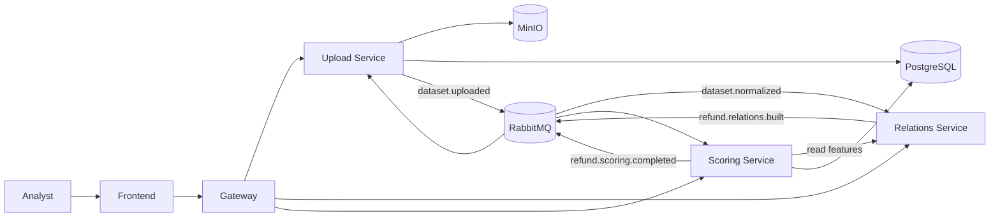

# Anti-Fraud Detector

Anti-Fraud Detector is an event-driven platform for finding suspicious refund approvals. It accepts a CSV dataset, builds relationships between refunds, calculates explainable risk scores, and gives an investigator a workflow for reviewing and exporting results.


## System at a glance

| Component | Purpose | Local entry point |
| --- | --- | --- |
| [Frontend](frontend/README.md) | Upload, progress, investigation, decisions, and export UI | `http://localhost` |
| [Gateway](backend/gateway/README.md) | Single HTTP entry point and backend routing | `http://localhost:8080` |
| [Upload Service](backend/upload-service/README.md) | CSV validation, storage, dataset metadata, and pipeline state | Internal `:8081` |
| [Relations Service](backend/relations-service/README.md) | Relationship graph and derived features | `http://localhost:8082` |
| [Scoring Service](backend/scoring-service/README.md) | Explainable scoring, investigation decisions, and CSV export | `http://localhost:8083` |

PostgreSQL, RabbitMQ, and MinIO are shared infrastructure dependencies, not application services maintained in this repository.

## End-to-end workflow



The normalizer that turns `dataset.uploaded` into `dataset.normalized` is an external pipeline stage. Without it, an uploaded job remains in progress unless the lifecycle event is supplied by an integration environment.

## Run and verify

Requirements: Docker Engine with Compose v2 and free ports `80`, `5432`, `5672`, `8080`, `8082`, `8083`, `9000`, `9001`, and `15672`. Make is optional and provides the shorter commands below.

Start and verify the complete application from the repository root using the [`Makefile`](Makefile):

```bash
make up
make ps
make smoke
```

The equivalent direct Docker Compose commands are:

```bash
test -f .env || cp .env.example .env
docker compose config --quiet
docker compose up --build -d
docker compose ps
./scripts/smoke-test.sh
```

Open `http://localhost`. Common whole-stack management commands are:

```bash
make logs
make restart
make down
```

Their Docker Compose equivalents are:

```bash
docker compose logs -f
docker compose restart
docker compose down
```

Commands for running and testing individual services are kept in their own documentation:

| Service | Commands |
| --- | --- |
| Frontend | [Local run](frontend/README.md#run-locally) · [Tests and build](frontend/README.md#verify) |
| API Gateway | [Run and verify](backend/gateway/README.md#run-and-verify) |
| Upload Service | [Run and verify](backend/upload-service/README.md#run-and-verify) |
| Relations Service | [Run and verify](backend/relations-service/README.md#run-and-verify) |
| Scoring Service | [Run and verify](backend/scoring-service/README.md#run-and-verify) |

Use `make clean` or `docker compose down -v` only when you intentionally want to stop the stack and delete local PostgreSQL and MinIO data.

## Main API flow

All UI traffic goes through the gateway:

```text
POST /api/datasets/upload
GET  /api/datasets/{datasetId}/preview
POST /api/analysis/{datasetId}/start
GET  /api/analysis/{jobId}/status
GET  /api/scoring/datasets/{datasetId}/suspicious-approvals
GET  /api/scoring/datasets/{datasetId}/returns/{returnId}/details
PUT  /api/scoring/datasets/{datasetId}/returns/{returnId}/decision
GET  /api/scoring/datasets/{datasetId}/export.csv
```

The complete request and event contracts are documented in [API contracts](docs/api-contracts.md).

## Documentation

Start with the [documentation index](docs/README.md). The key references are:

- [Architecture and boundaries](docs/architecture.md)
- [API and RabbitMQ contracts](docs/api-contracts.md)
- [CSV data format](docs/data-format.md)
- [Scoring rules](docs/scoring-rules.md)
- [Operations and deployment](docs/devops.md)
- [Demo flow](docs/demo-flow.md)
- [Release readiness](docs/release-readiness.md)

Service-specific setup, configuration, interactions, and workflows live next to each service in its own README.

## Completed bonus goals

In addition to the core MVP, the team completed the following bonus goals defined at the start of the project:

- **Dataset management:** Upload Service provides dataset history, terminal archive, analysis retry, and a persistent lifecycle audit.
- **Idempotent orchestration:** repeated start and retry requests reuse the claimed or previously created job, reducing duplicate pipeline processing.
- **Reliable asynchronous processing:** the Upload Service consumer uses bounded RabbitMQ retries, persistent republishing, publisher confirms, manual acknowledgements, and a durable dead-letter queue.
- **Support-agent investigation context:** dataset-scoped risk summaries combine approval rate, override rate, high-risk approvals, top reasons, and business-readable relation context.
- **Relationship risk signals:** scoring includes repeated customer-agent pairs and suspicious relation clusters derived by Relations Service.
- **Detailed scoring explanations:** each result contains a top reason and individual business-readable reasons with their score impact.
- **Analyst decision controls:** the frontend lets an analyst choose a follow-up action and outcome and enter reviewer notes.
- **Dirty-export validation:** the normalization and scoring pipeline is validated against three independently generated business exports: Business, ShopFlow, and RetailHub.
- **Shared Python-Kotlin golden fixtures:** the Python validator mirrors the Kotlin scoring contract and reproduces all `45/45` frozen demo cases.
- **Automated scoring-quality checks:** deterministic validation reports precision, recall, false positives, and missed suspicious cases and fails on scenario regressions.
- **Repeatable release verification:** deployment smoke-test commands and a stable end-to-end demo flow are documented for the team.

Implementation evidence is available in the [Upload Service implementation notes](backend/upload-service/IMPLEMENTATION.md), [scoring rules](docs/scoring-rules.md), [API contracts](docs/api-contracts.md), [demo flow](docs/demo-flow.md), [`evaluate_scenarios.py`](docs/scripts/evaluate_scenarios.py), and [`validate_pipeline.py`](docs/scripts/validate_pipeline.py).

## Project status

The repository contains an integrated release-candidate implementation. Before calling a public deployment production-ready, verify the live scoring health endpoint and capture a complete upload-to-results run; the current evidence and remaining checks are tracked in [release readiness](docs/release-readiness.md).

## License

Released under the [MIT License](LICENSE.md).
