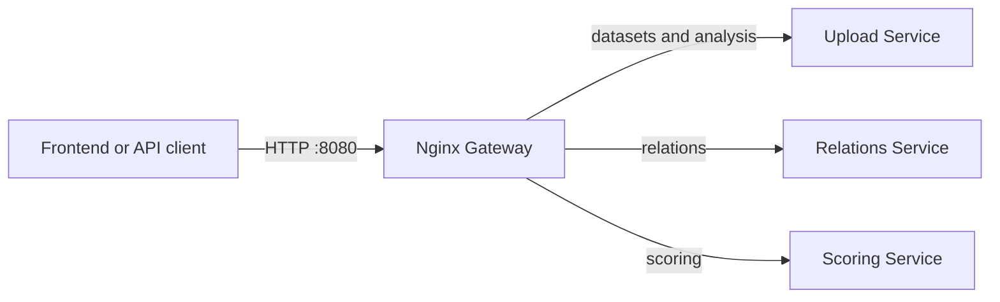
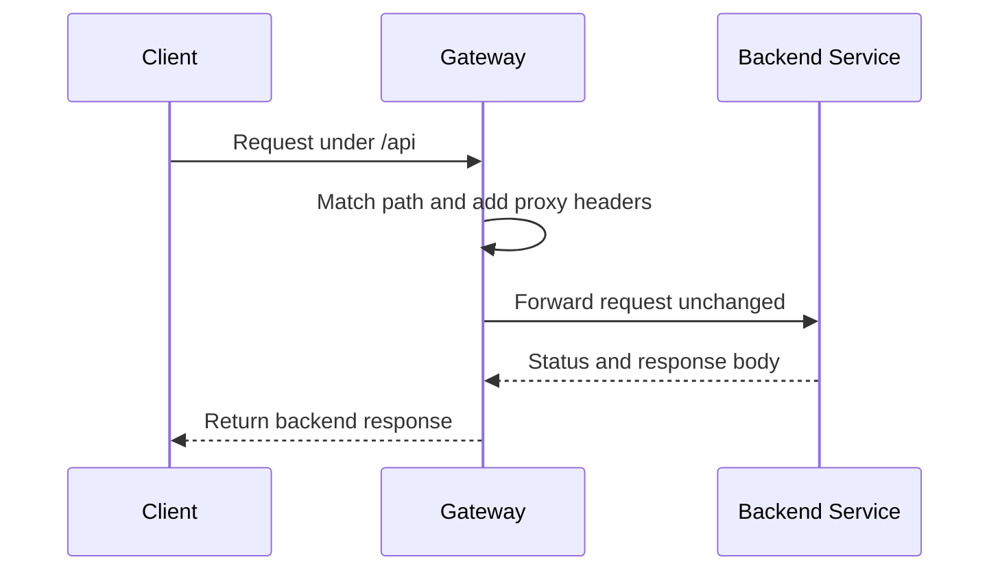

# API Gateway

Nginx-based entry point that exposes one stable HTTP API and routes requests to the three backend services. It contains no business logic or persistent state.

## Routes

| Public path | Target |
| --- | --- |
| `/api/datasets*` | Upload Service `:8081` |
| `/api/analysis*` | Upload Service `:8081` |
| `/api/relations/*` | Relations Service `:8082` |
| `/api/scoring*` | Scoring Service `:8083` |
| `/health` | Gateway health response |

The upload limit is `51 MiB`, leaving multipart overhead above the Upload Service's `50 MiB` file limit.

## Service interactions



## Workflow



## Run and verify

The gateway is designed to run from the repository root:

```bash
docker compose up -d gateway
curl -fsS http://localhost:8080/health
```

Validate configuration after route changes:

```bash
docker compose config --quiet
docker compose exec gateway nginx -t
```

Configuration lives in `nginx.conf`. A backend health failure is not hidden by the gateway: its own `/health` can be healthy while a proxied service is unavailable, so release checks must probe every service endpoint.
