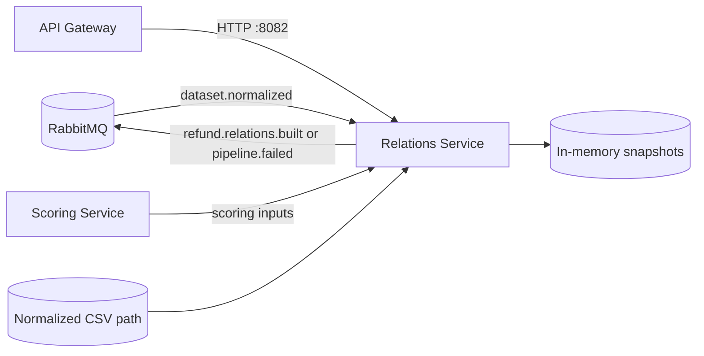
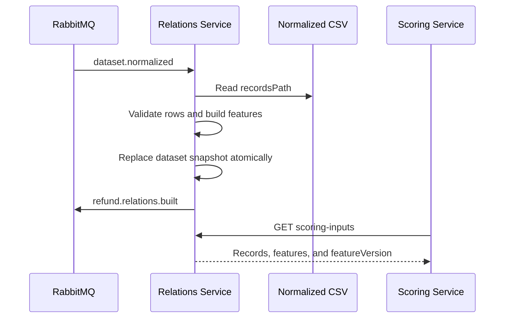

# Relations Service

Go service that turns a normalized refund dataset into relationship and behavioral features. It serves graph, customer, agent, and per-return context to the UI and Scoring Service.

## Responsibilities

- consume `dataset.normalized` and load the referenced normalized CSV;
- calculate per-return, customer, agent, pair-frequency, and cluster features;
- expose dataset-scoped relationship and analytics endpoints;
- provide a versioned scoring-input snapshot to Scoring Service;
- publish `refund.relations.built` or a correlated `pipeline.failed` event.

## Service interactions



## Workflow



On validation or loading failure, the service leaves the previous snapshot intact and publishes `pipeline.failed` with `stage=RELATIONS`.

## Main API

All primary endpoints are dataset-scoped under `/api/relations/datasets/{datasetId}`:

| Path suffix | Purpose |
| --- | --- |
| `/rebuild` (`POST`) | Republish completion for the loaded snapshot |
| `/scoring-inputs` | Versioned records and features for scoring |
| `/returns/{returnId}` | Direct relationship context |
| `/returns/{returnId}/features` | Derived feature vector |
| `/returns/{returnId}/related` | Ranked related refunds |
| `/returns/{returnId}/graph` | Bounded graph for investigation |
| `/customers/{customerId}/history` | Customer refund history |
| `/customers/{customerId}/summary` | Customer aggregates |
| `/agents/{agentId}/summary` | Agent aggregates |
| `/agents/ranked` | Ranked agent analytics |

Health: `GET /api/relations/health`. Legacy unscoped read routes remain available for the `demo` dataset.

## Configuration

| Variable | Default | Purpose |
| --- | --- | --- |
| `SERVER_PORT` | `:8082` | HTTP listener |
| `RABBITMQ_ENABLED` | `false` | Enable the event consumer and publisher |
| `RABBITMQ_URL` | local RabbitMQ | Broker connection |
| `RABBITMQ_EXCHANGE` | `pipeline.exchange` | Topic exchange |
| `RABBITMQ_NORMALIZED_QUEUE` | `relations.dataset-normalized.queue` | Durable input queue |
| `RELATIONS_DATASET_ID` | `demo` | Optional startup dataset ID |
| `RELATIONS_DATASET_PATH` | empty | Optional normalized CSV loaded at startup |
| `RELATIONS_DEMO_FALLBACK_ENABLED` | `true` locally | Allow embedded demo records |

The root Compose stack deliberately sets demo fallback to `false`; production-like runs must receive a real normalized artifact.

## Run and verify

```bash
go test ./...
```

Connected stack:

```bash
docker compose up -d rabbitmq relations-service gateway
curl -fsS http://localhost:8080/api/relations/health
```

Dataset snapshots are in memory. After a restart, they must be loaded again from the configured path or rebuilt by a new `dataset.normalized` event.
