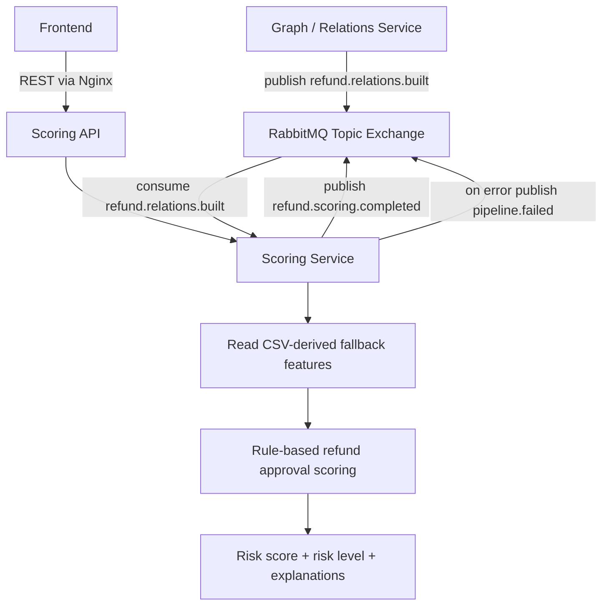

<h1 align="center">Scoring Service</h1>

The Scoring Service calculates refund approval risk scores for suspicious refund approvals in e-commerce support workflows.

It is responsible for:

* `RefundApprovalRiskScore`;
* `SuspiciousRefundApproval`;
* risk levels;
* scoring rules;
* explanations;
* suspicious refund approvals API;
* consuming `refund.relations.built`;
* publishing `refund.scoring.completed`.

<h2 align="center">Service Flow</h2>



<h2 align="center">Running the Scoring Service</h2>

Prerequisites:

* JDK 17;
* RabbitMQ for pipeline event consumption;
* free local port `8083` when running together with the Go upload service.

If RabbitMQ is not already running, start the shared local broker from the upload-service compose file:

```bash
cd backend/upload-service
docker compose up -d rabbitmq
```

Run tests:

```bash
cd backend/scoring-service
./gradlew test
```

Run full local build:

```bash
cd backend/scoring-service
./gradlew clean build
```

Build and run with the root compose stack:

```bash
docker compose build scoring-service
docker compose up -d scoring-service
```

Run locally on port `8083`:

```bash
cd backend/scoring-service
SERVER_PORT=8083 \
SPRING_RABBITMQ_HOST=localhost \
SPRING_RABBITMQ_PORT=5672 \
SPRING_RABBITMQ_USERNAME=guest \
SPRING_RABBITMQ_PASSWORD=guest \
./gradlew bootRun
```

If the service is started without `SERVER_PORT`, it uses the port configured in `src/main/resources/application.yml`.

Health check:

```bash
curl http://localhost:8083/api/scoring/health
```

Load demo suspicious approvals:

```bash
curl http://localhost:8083/api/scoring/datasets/demo/suspicious-approvals
```

Load demo refund approval details:

```bash
curl http://localhost:8083/api/scoring/datasets/demo/returns/return_3041/details
```

Load demo support agent summary:

```bash
curl http://localhost:8083/api/scoring/datasets/demo/agents/agent_999/risk-summary
```

Gateway smoke commands, when the root compose stack is running:

```bash
curl http://localhost:8080/api/scoring/health
curl http://localhost:8080/api/scoring/datasets/demo/suspicious-approvals
curl http://localhost:8080/api/scoring/datasets/demo/returns/return_3041/details
curl http://localhost:8080/api/scoring/datasets/demo/agents/agent_999/risk-summary
```

The scoring service consumes `refund.relations.built` from `pipeline.exchange` and publishes `refund.scoring.completed` or `pipeline.failed`.

Relation feature integration is event-ready for the MVP. Until relation features
are persisted in scoring, the service derives these feature names from the CSV:
`customerReturnCount`, `agentApprovalRate`, `customerAgentPairCount`, `clusterSize`,
`refundAmountRatio`, and `strongestRelationType`. Responses mark this as
`featureSource: "CSV_DERIVED_FALLBACK"`.

<h2 align="center">API Endpoints</h2>

```text
GET /api/scoring/health
GET /api/scoring/datasets/{datasetId}/suspicious-approvals
GET /api/scoring/datasets/{datasetId}/returns/{returnId}/risk
GET /api/scoring/datasets/{datasetId}/returns/{returnId}/details
GET /api/scoring/datasets/{datasetId}/agents/{agentId}/risk-summary
GET /api/scoring/returns/{returnId}/risk
GET /api/scoring/agents/{agentId}/risk-summary
POST /api/scoring/datasets/{datasetId}/recalculate
```

The dataset-scoped endpoints are the stable frontend contract. The older
`/api/scoring/returns/{returnId}/risk` and `/api/scoring/agents/{agentId}/risk-summary`
routes are kept for demo compatibility and use the `demo` dataset internally.

Unknown literal dataset IDs and return IDs return JSON `404` responses. Uploaded
UUID dataset IDs currently use the same CSV-derived fallback data until normalized
dataset storage is connected to scoring.

<h2 align="center">Risk Factors</h2>

```text
NO_EVIDENCE
HIGH_VALUE_REFUND
FULL_AMOUNT_REFUND
FAST_APPROVAL
MANUAL_OVERRIDE
AGENT_HIGH_APPROVAL_RATE
CUSTOMER_FREQUENT_RETURNS
REPEATED_AGENT_CUSTOMER_PAIR
SUSPICIOUS_CLUSTER
```

<h2 align="center">Rule-Based Scoring Draft</h2>

| Rule | Condition | Score Impact |
| --- | --- | --- |
| NO_EVIDENCE | Refund approved without evidence | +25 |
| HIGH_VALUE_REFUND | Refund amount is above threshold | +20 |
| FULL_AMOUNT_REFUND | Refund amount is close to order amount | +15 |
| FAST_APPROVAL | Approval happened too quickly | +15 |
| MANUAL_OVERRIDE | Manual override was used | +20 |
| AGENT_HIGH_APPROVAL_RATE | Agent approval rate is unusually high | +30 |
| CUSTOMER_FREQUENT_RETURNS | Customer has many refund requests | +20 |
| REPEATED_AGENT_CUSTOMER_PAIR | Same agent repeatedly approves same customer | +25 |
| SUSPICIOUS_CLUSTER | Approval belongs to suspicious graph cluster | +25 |

Rules are evaluated in the table order so `topReason` and the `reasons` array are
deterministic for the same input. Scores above `100` are capped at `100`.

<h2 align="center">Risk Levels</h2>

```text
0-30 LOW
31-60 MEDIUM
61-80 HIGH
81-100 CRITICAL
```

<h2 align="center">Events</h2>

Consumes:

```text
refund.relations.built
```

Publishes:

```text
refund.scoring.completed
```

<h2 align="center">Example Suspicious Refund Approval Response</h2>

```json
{
  "datasetId": "demo",
  "returnId": "return_123",
  "orderId": "order_456",
  "customerId": "customer_789",
  "supportAgentId": "agent_001",
  "refundAmount": 249.99,
  "orderAmount": 299.99,
  "decision": "APPROVED",
  "riskScore": 84,
  "riskLevel": "HIGH",
  "topReason": "Refund approved without evidence for a high-value order",
  "reasons": [
    {
      "type": "NO_EVIDENCE",
      "message": "Refund was approved without required evidence",
      "scoreImpact": 25
    },
    {
      "type": "HIGH_VALUE_REFUND",
      "message": "Refund amount is above threshold",
      "scoreImpact": 20
    },
    {
      "type": "AGENT_HIGH_APPROVAL_RATE",
      "message": "Support agent approval rate is unusually high",
      "scoreImpact": 30
    }
  ],
  "calculatedAt": "2026-06-01T10:15:00Z"
}
```

<h2 align="center">Demo Return IDs</h2>

| returnId | Expected Level | Main Reasons | Explanation |
| --- | --- | --- | --- |
| `return_300347` | LOW | none expected | Normal approval with evidence and no repeated relation pattern. |
| `return_303075` | MEDIUM | `NO_EVIDENCE`, `HIGH_VALUE_REFUND` | High-value refund approved without evidence. |
| `return_3011` | CRITICAL | `NO_EVIDENCE`, `HIGH_VALUE_REFUND`, `FULL_AMOUNT_REFUND` | Full refund of a high-value order without evidence. |
| `return_3041` | CRITICAL | `NO_EVIDENCE`, `HIGH_VALUE_REFUND`, `FAST_APPROVAL`, `MANUAL_OVERRIDE`, relation pattern rules | Repeated customer-agent pattern with manual overrides and high-value fast approvals. |

<h2 align="center">Known Limitations</h2>

* Scores are calculated from the current CSV-backed dataset and are not persisted.
* Uploaded UUID dataset IDs use CSV-derived fallback data until normalized dataset storage is connected to scoring.
* Relation-style fields are mirrored from CSV-derived features. Full relation-feature storage and handoff from Relations Service remains a follow-up integration task.
* Gateway smoke commands require the full root compose stack.
