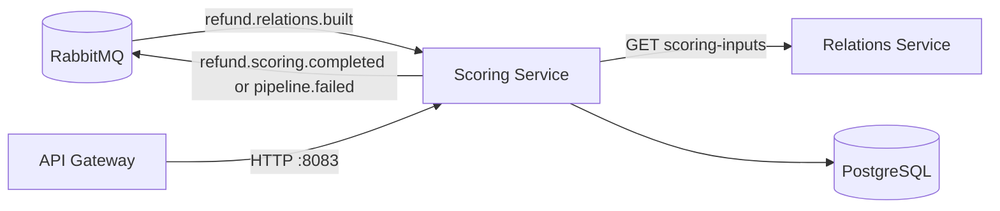
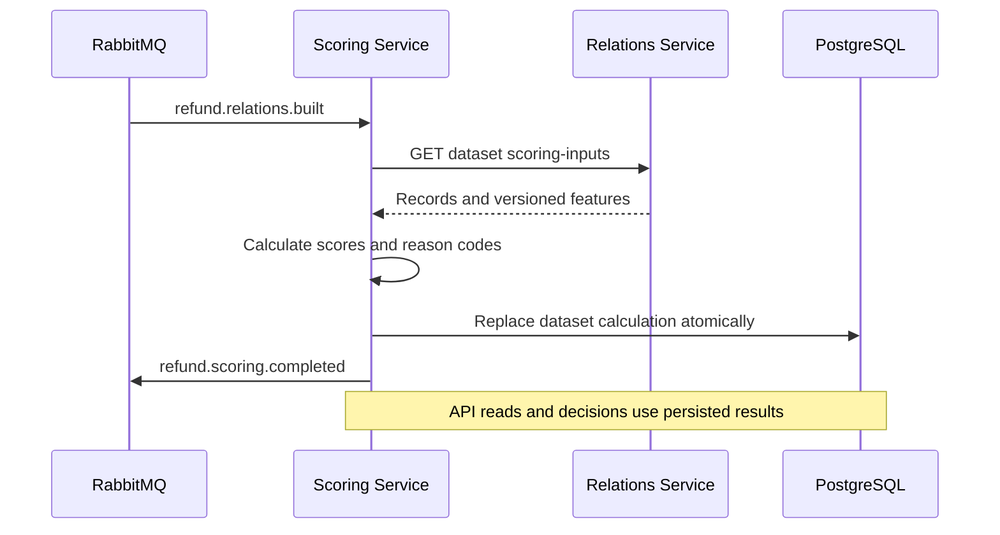

# Scoring Service

Kotlin and Spring Boot service that calculates explainable refund-approval risk, persists results, and supports the investigator decision and export workflow.

## Responsibilities

- consume `refund.relations.built` events;
- fetch the matching versioned feature snapshot from Relations Service;
- calculate deterministic score, risk level, summary, and reason codes;
- persist calculations and investigation decisions in PostgreSQL;
- expose filtered results, details, agent summaries, decisions, and CSV export;
- publish `refund.scoring.completed` or `pipeline.failed`.

## Service interactions



## Workflow



If Relations Service is unavailable, its contract is invalid, or persistence fails, the service publishes `pipeline.failed` with `stage=SCORING` and does not report false completion.

## Main API

Base path: `/api/scoring`.

| Method and path | Purpose |
| --- | --- |
| `GET /health` | Service health |
| `GET /datasets/{datasetId}/suspicious-approvals` | Filtered result list |
| `GET /datasets/{datasetId}/returns/{returnId}/risk` | Score and reasons |
| `GET /datasets/{datasetId}/returns/{returnId}/details` | Investigation detail |
| `GET /datasets/{datasetId}/agents/{agentId}/risk-summary` | Agent aggregates |
| `POST /datasets/{datasetId}/recalculate` | Recalculate from Relations data |
| `GET, PUT /datasets/{datasetId}/returns/{returnId}/decision` | Read or save a decision |
| `GET /datasets/{datasetId}/export.csv` | Filtered CSV export |

List and export filters are `risk`, `agent`, and `outcome`.

## Configuration

| Variable | Default | Purpose |
| --- | --- | --- |
| `SERVER_PORT` | `8083` | HTTP listener |
| `SCORING_DB_URL` | local `upload_db` | PostgreSQL JDBC URL |
| `SCORING_DB_USER`, `SCORING_DB_PASSWORD` | `postgres` | Database credentials |
| `SPRING_RABBITMQ_*` | local RabbitMQ | Broker connection |
| `RELATIONS_BASE_URL` | `http://localhost:8082` | Relations Service address |
| `SCORING_DEMO_ENABLED` | `false` | Explicit demo-only provider |

Do not enable demo mode for production dataset IDs.

## Run and verify

Requirements for local execution: Java 17 and reachable PostgreSQL, RabbitMQ, and Relations Service.

```bash
./gradlew bootRun
```

Tests and production build:

```bash
./gradlew clean test build
```

Connected health check:

```bash
docker compose up -d postgres rabbitmq relations-service scoring-service gateway
curl -fsS http://localhost:8080/api/scoring/health
```

Scoring rules and thresholds are documented in [`../../docs/scoring-rules.md`](../../docs/scoring-rules.md).
