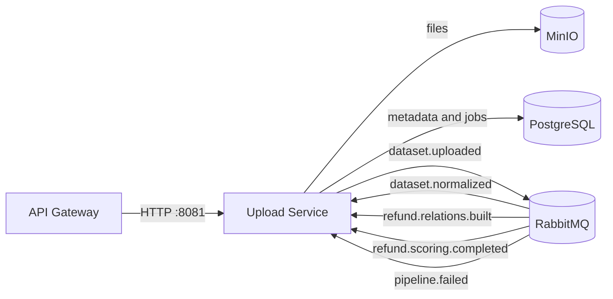
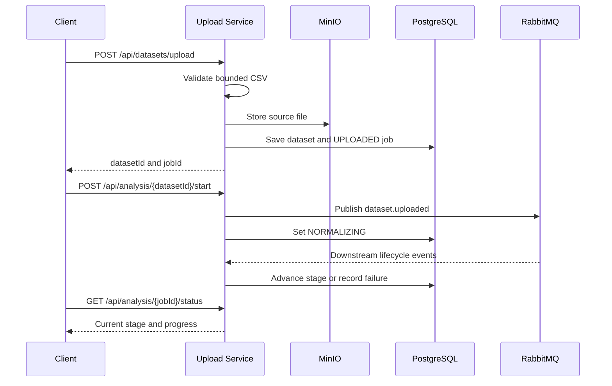

# Upload Service

Go service that owns CSV ingestion and the analysis lifecycle. It validates uploads, stores source files in MinIO, persists dataset and job metadata in PostgreSQL, and coordinates pipeline progress through RabbitMQ.

## Responsibilities

- validate CSV type, headers, rows, size, and row-count limits;
- store accepted files under a generated dataset ID;
- expose dataset list, details, preview, archive, and analysis APIs;
- publish `dataset.uploaded` exactly once when a job starts;
- consume downstream lifecycle events and persist progress, failures, and audit history.

## Service interactions



## Workflow



Normal progression is `UPLOADED → NORMALIZING → BUILDING_RELATIONS → SCORING → COMPLETED`; `NORMALIZED` remains a compatible public status. Any active stage can transition to `FAILED`.

## Main API

| Method and path | Purpose |
| --- | --- |
| `GET /api/datasets/health` | Service health |
| `POST /api/datasets/upload` | Validate and store one CSV |
| `GET /api/datasets` | List datasets |
| `GET /api/datasets/{datasetId}` | Dataset metadata |
| `GET /api/datasets/{datasetId}/preview` | Bounded row preview |
| `POST /api/datasets/{datasetId}/archive` | Archive a dataset |
| `POST /api/analysis/{datasetId}/start` | Start or return the existing job |
| `GET /api/analysis/{jobId}/status` | Pipeline status |
| `POST /api/analysis/{jobId}/retry` | Retry a failed job |

The machine-readable contract is in [`docs/openapi.yaml`](docs/openapi.yaml).

## Configuration

| Variables | Purpose | Defaults |
| --- | --- | --- |
| `SERVER_PORT` | HTTP listener | `:8081` |
| `DB_HOST`, `DB_PORT`, `DB_USER`, `DB_PASSWORD`, `DB_NAME` | PostgreSQL connection | local PostgreSQL |
| `MINIO_ENDPOINT`, `MINIO_ACCESS_KEY`, `MINIO_SECRET_KEY`, `MINIO_BUCKET` | Object storage | local MinIO, bucket `datasets` |
| `RABBITMQ_URL`, `RABBITMQ_EXCHANGE` | Event transport | local RabbitMQ, `pipeline.exchange` |
| `RABBITMQ_UPLOAD_EVENTS_QUEUE`, `RABBITMQ_UPLOAD_DLQ`, `RABBITMQ_MAX_RETRIES` | Durable consumer and retry policy | project defaults |
| `UPLOAD_MAX_FILE_SIZE_BYTES`, `UPLOAD_MAX_ROWS`, `UPLOAD_MAX_VALIDATION_ERRORS` | Input bounds | 50 MiB, 250,000 rows, 100 errors |

Use the root `.env.example` as the supported Compose configuration.

## Run and verify

The simplest connected setup is the root stack:

```bash
docker compose up -d postgres rabbitmq minio upload-service gateway
curl -fsS http://localhost:8080/api/datasets/health
```

For code checks:

```bash
go test ./...
```

Database migrations run at startup. The status `PATCH` route is disabled by default and should only be enabled for controlled administration or tests.
