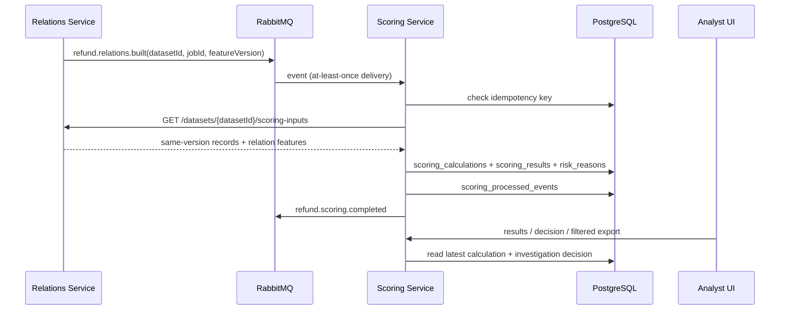

# Architecture — Week 6 RC

Fraud & Abuse Detection System is an explainable refund-investigation MVP. All public API calls enter through Nginx; service-to-service handoffs use RabbitMQ and an internal dataset-scoped Relations API.

## Components and ports

| Component | Internal port | Responsibility |
| --- | ---: | --- |
| Frontend | `80` | Upload, lifecycle status, suspicious approvals, investigation UI. |
| Gateway | `8080` | Routes `/api/datasets`, `/api/analysis`, `/api/relations`, `/api/scoring`. |
| Upload Service | `8081` | CSV ingestion, MinIO objects, dataset/job lifecycle and audit. |
| Relations Service | `8082` | Dataset-scoped normalized records, graph relations, persisted-in-service feature snapshot. |
| Scoring Service | `8083` | Rules, versioned results/reasons, analyst decisions, filters and export. |
| PostgreSQL | `5432` | Upload lifecycle and durable scoring/investigation state. |
| RabbitMQ | `5672` / `15672` | Durable topic exchange and management UI. |
| MinIO | `9000` / `9001` | Uploaded dataset objects and console. |

## Dataset-scoped scoring flow



The handoff is atomic at the Relations snapshot boundary: every record and feature envelope carries the requested `datasetId`, and the response has one `featureVersion`. Scoring rejects cross-dataset records, missing features, and version mismatch.

Production scoring uses `featureSource: RELATIONS_SERVICE`. `DEMO_CSV` is available only when `SCORING_DEMO_ENABLED=true` (tests or an explicitly configured demo); it is never selected for an arbitrary UUID.

## Persistence

Flyway owns these scoring tables:

| Table | Purpose |
| --- | --- |
| `scoring_calculations` | One version row per dataset recalculation. |
| `scoring_results` | Record facts, score, level, source, feature JSON and timestamps. |
| `risk_reasons` | Ordered, queryable reason rows with score impact. |
| `investigation_decisions` | Durable analyst action/outcome/note and audit timestamps. |
| `scoring_processed_events` | Duplicate RabbitMQ delivery protection. |

Results are append-versioned. Read APIs return the latest calculation; analyst decisions are keyed by dataset/return and therefore survive recalculation and service restart.

## Events

| Routing key | Producer | Consumer | Required fields |
| --- | --- | --- | --- |
| `dataset.uploaded` | Upload | Upload normalization consumer | `datasetId`, `jobId`, object metadata |
| `dataset.normalized` | Upload normalization consumer | Relations | `datasetId`, `jobId`, `recordsPath`, `recordCount`, `schemaVersion` |
| `refund.relations.built` | Relations | Scoring, lifecycle | `datasetId`, `jobId`, `recordsCount`, `featuresCount`, `featureVersion` |
| `refund.scoring.completed` | Scoring | lifecycle | `datasetId`, `jobId`, `scoredApprovalsCount`, `suspiciousApprovalsCount` |
| `pipeline.failed` | any stage | lifecycle | `datasetId`, `jobId`, `stage`, `errorCode`, `errorMessage` |

Scoring's event key is `datasetId:jobId:featureVersion`; without a job ID it is `datasetId:feature:featureVersion`. Duplicate deliveries return the stored counts and do not create a second calculation.

## Statuses

```text
UPLOADED -> NORMALIZING -> NORMALIZED -> BUILDING_RELATIONS -> SCORING -> COMPLETED
                                                                  \-> FAILED
```

## Honest limitations

* Normalization runs inside Upload service and writes canonical artifacts to the shared `normalized_data` volume. A separately scalable normalization service is not included.
* Relations snapshots are rebuilt in memory from the normalized artifact. Scoring results and analyst work are durable; the Relations in-memory cache must be rebuilt after restart.
* A dedicated graph database is not connected; graph projections are calculated by Relations service logic.
* Public deployment must not be called release-ready until the deployed SHA is matched to the documented RC SHA.
