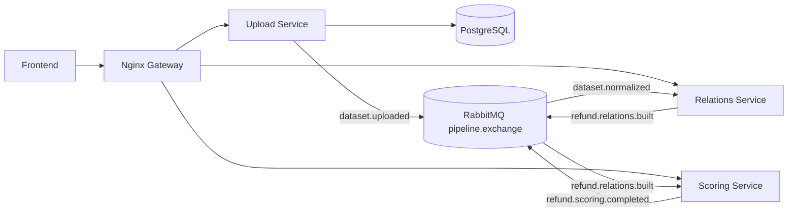

<h1 align="center">Architecture</h1>

Fraud & Abuse Detection System is an MVP for e-commerce teams that need to find suspicious refund approvals in support workflows.

## Current Components

| Component | Responsibility |
| --- | --- |
| Frontend | Analyst dashboard: upload, status, suspicious approvals, refund details. |
| Gateway | Nginx entry point for `/api/...` routes. |
| Upload Service | CSV upload, dataset preview, analysis jobs, status, `dataset.uploaded`. |
| Relations Service | Refund relation API and relation-style features for scoring. |
| Scoring Service | Rule-based risk score, risk level, explanations, scoring events. |
| PostgreSQL | Dataset/job storage for implemented backend services. |
| RabbitMQ | Async pipeline events between backend stages. |

## Flow



## Pipeline Events

| Event | Producer | Consumer | Purpose |
| --- | --- | --- | --- |
| `dataset.uploaded` | Upload Service | Normalization stage | Dataset is stored and ready to process. |
| `dataset.normalized` | Normalization stage | Relations Service | Internal refund records are ready. |
| `refund.relations.built` | Relations Service | Scoring Service | Relation features are ready or can be derived. |
| `refund.scoring.completed` | Scoring Service | Status/API layer | Scores and suspicious counts are calculated. |
| `pipeline.failed` | Any stage | Status/API layer | Processing failed with a reason. |

## Relation Model

The graph-oriented model connects:

```text
Customer -> Order -> ReturnRequest -> SupportAgent -> Decision -> ProductCategory
```

Important relation signals:

* frequent customer returns;
* high support-agent approval rate;
* repeated customer-agent approval pattern;
* suspicious relation cluster;
* refund amount ratio.

In the current MVP, Scoring Service exposes these relation-style fields with `featureSource: "CSV_DERIVED_FALLBACK"` until persisted relation-feature handoff is connected.

## Design Decisions

| Decision | Rationale |
| --- | --- |
| Async pipeline | Upload, normalization, relations, and scoring can take different amounts of time; RabbitMQ keeps services decoupled. |
| Gateway first | Frontend uses one `/api` entry point instead of service-specific URLs. |
| Rule-based scoring | Deterministic, explainable, and easier to validate before real labelled fraud data exists. |
| Risk explanations | Analysts need reasons, not only a score, to trust and act on flagged approvals. |

## Known Limits

* Full normalization and persisted relation-feature storage are still follow-up integration work.
* Uploaded UUID datasets currently use scoring CSV fallback until normalized storage is connected.
* Graph DB is represented by the relations model/API; dedicated graph storage remains optional for the MVP demo.
