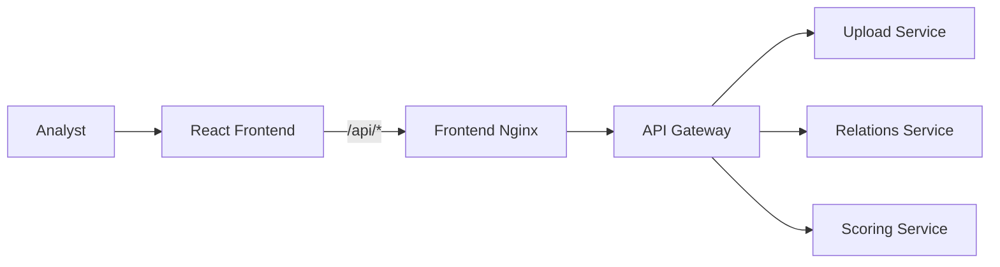
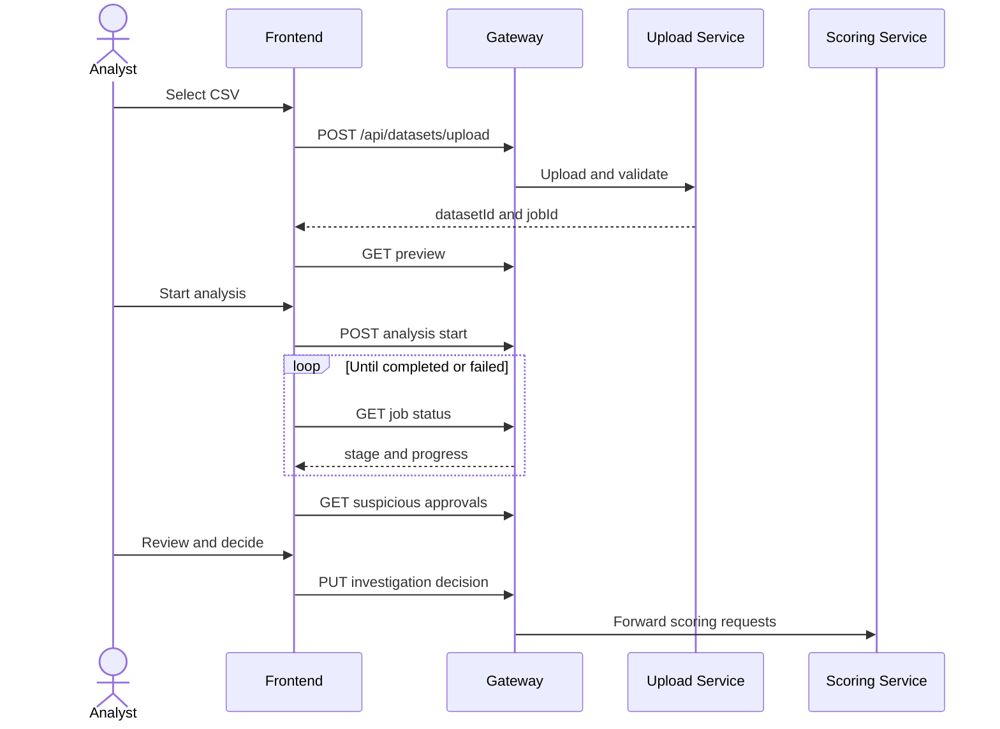

# Frontend

React and TypeScript interface for the analyst workflow: upload a refund dataset, monitor processing, investigate suspicious approvals, record a decision, and export results.

## Responsibilities

- validate the selected CSV and show an upload preview;
- start analysis and poll the pipeline status;
- filter suspicious approvals by risk, agent, and investigation outcome;
- show scoring reasons and relationship context;
- save investigation decisions and download a filtered CSV export.

## Service interactions



The browser uses relative `/api` URLs. In Docker, the frontend Nginx container forwards them to `gateway:8080`, so backend service addresses never leak into browser configuration.

## Workflow



## Run locally

Requirements: Node.js 20+ and npm.

```bash
npm install
npm run dev
```

Vite serves the UI at `http://localhost:5173`. For a fully connected environment, start the root Docker Compose stack instead and open `http://localhost`.

## Verify

```bash
npm test
npm run build
```

## Key configuration

| File | Purpose |
| --- | --- |
| `src/App.tsx` | Application state and API workflow |
| `src/styles.css` | Product styles and responsive layout |
| `nginx.conf` | Static hosting and `/api` proxy |
| `vite.config.ts` | Development and test configuration |

The frontend does not store credentials or business data. Persistent state belongs to the backend services.
