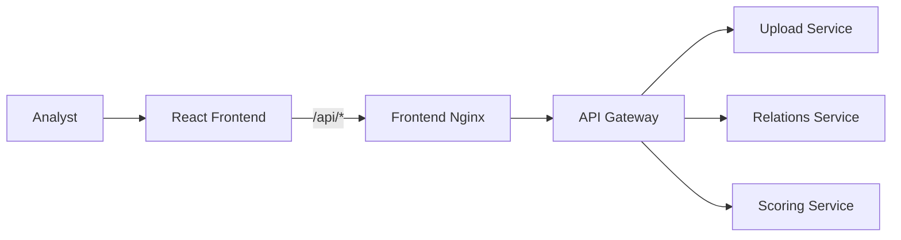

# Frontend

React and TypeScript analyst workspace for dataset-scoped refund fraud investigation.

## Responsibilities

- upload a CSV and show its bounded preview and detected mapping;
- start analysis and poll until a terminal `COMPLETED` or `FAILED` status;
- filter suspicious approvals and show explicit loading, empty, failed, and unavailable states;
- show scoring explanations plus dataset-scoped customer, agent, and relation-graph context;
- preserve the active dataset, job, page, filters, and selected return across refreshes;
- load and save analyst decisions, including final-outcome confirmation and save errors;
- export filtered CSV reports;
- list, reopen, retry, inspect, and archive datasets and their analysis history.

## Service interactions



The browser uses relative `/api` URLs. Vite proxies development traffic to `http://localhost:8080`; the production Nginx container proxies the same paths to `gateway:8080`.

## Live flow

1. Upload a CSV to `POST /api/datasets/upload`.
2. Load preview metadata, detected mapping, row count, and truncation state.
3. Start analysis and poll the returned job until `COMPLETED` or `FAILED`.
4. Load suspicious approvals for the uploaded `datasetId` only.
5. Open scoring details and dataset-scoped customer, agent, and graph context.

The release path never substitutes demo approvals, details, analytics, or relation data for an uploaded UUID.

## Run locally

Requirements: Node.js 20+ and npm.

```bash
npm ci
npm run dev
```

The development server is available at `http://localhost:5173`. For the complete environment, start the root Docker Compose stack and open `http://localhost`.

## Verify

```bash
npm run test
npm run build
npx playwright install chromium firefox
npm run test:e2e
```

Vitest covers successful completion, failed analysis, empty results, persisted refresh context, details failures, normalization, pagination, and graph accessibility/truncation.

Playwright exercises the mocked contract flow in Chromium and Firefox at `1366x768`:

```text
upload -> preview -> completed -> approvals -> details -> analytics/graph -> saved decision -> CSV export
```

The external release checklist is documented in [`../docs/frontend-e2e-checklist.md`](../docs/frontend-e2e-checklist.md).

## Release verification

The local frontend contract flow is covered in Chromium and Firefox. Final screenshots and external-VM evidence must be captured from the deployed release candidate using the linked checklist.
